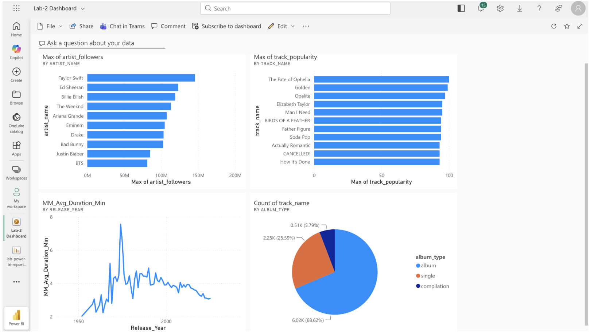
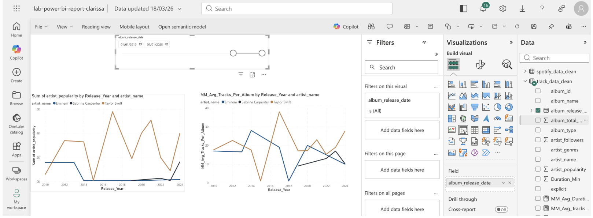
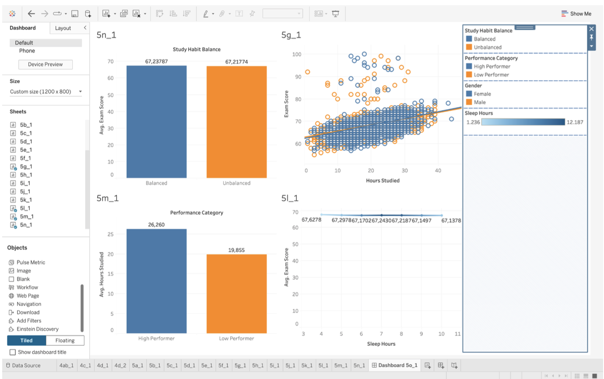

# Business Intelligence Dashboards — Individual Coursework

> **Inteligensi Bisnis (IBIS) | Fakultas Ilmu Komputer, Universitas Indonesia**
> Clarissa Indriana Pramesti — 2306211660

Individual coursework covering two end-to-end BI assignments: **Power BI** (music streaming analytics) and **Tableau** (student performance analytics). Each assignment includes data preparation, DAX/calculated field implementation, and dashboard storytelling.

---

## Assignment 1 — Power BI

**Dataset:** `spotify_data_clean.xlsx` + `track_data_final.xlsx` (Spotify music streaming data)
**Tool:** Microsoft Power BI Desktop

### DAX Functions Implemented

| Function | Use Case |
|---|---|
| `IF()` | Conditional categorization of tracks/artists |
| `FILTER()` | Filtered measures for specific artist or album subsets |
| `DATEADD()` | Time-shifted comparisons (e.g., year-over-year duration trend) |
| `RANKX()` | Ranking artists by follower count and songs by popularity |
| `SUMX()` | Row-by-row aggregation across filtered contexts |

### Drill Features
- **Drill Down & Drill Up** — hierarchical navigation within charts (e.g., year → month level on duration trend)
- **Drill Through** — cross-page navigation to detailed artist/album views

### Dashboards Built

**Dashboard 1 — Music Overview** (`spotify_data_clean.xlsx` + `track_data_final.xlsx`)

Combines four visualizations on a single page:

| Chart | Description |
|---|---|
| 5a | Top 10 artists by follower count (bar chart) |
| 5b | Top 10 most popular songs of all time (bar chart) |
| 5c | Average song duration by year (line chart) |
| 5d | Album type proportion — single vs album vs compilation (pie chart) |

> 📸 ****

---

**Dashboard 2 — Artist Comparison** (`track_data_final.xlsx`)

Filters: January 2010 – January 2025 (via slicer)

| Chart | Description |
|---|---|
| 5f | Popularity trend over time — Eminem vs Sabrina Carpenter vs Taylor Swift (line chart) |
| 5g | Average songs per album released per year — same 3 artists (line/bar chart) |

> 📸 ****

---

## Assignment 2 — Tableau

**Dataset:** `DatasetPerformaSiswa.csv` (Student performance dataset)
**Tools:** Python (Pandas) for data preparation → Tableau for visualization

### Data Preparation (Python)

Cleaned dataset before loading into Tableau. Steps performed in `*.ipynb`:
- Null value handling
- Duplicate record removal
- Outlier detection and treatment
- Data type validation and formatting
- Export to cleaned `.csv` for Tableau input

### Calculated Fields

| Field | Logic |
|---|---|
| `Performance Category` | `IF [Exam Score] >= 75 THEN "High Performer" ELSE "Low Performer" END` |
| `Study Habit Balance` | `IF [Hours Studied] >= 5 AND [Sleep Hours] >= 7 THEN "Balanced" ELSE "Unbalanced" END` |

### Visualizations Built (13 charts)

| No. | Question | Chart Type |
|---|---|---|
| 5a | Study hours comparison by gender | Bar chart |
| 5b | Student composition by gender | Pie / donut chart |
| 5c | Student motivation level overview | Bar chart |
| 5d | Attendance composition — disabled vs non-disabled students | Stacked bar |
| 5e | Average exam score by attendance level | Bar chart |
| 5f | Academic performance distribution by exam score | Histogram / bins |
| 5g | Does study duration affect exam score? | Scatter plot |
| 5h | Does attendance affect academic performance? | Line / bar chart |
| 5i | Previous score vs exam score by teacher quality | Scatter plot |
| 5j | Parent education level vs student exam score | Bar chart |
| 5k | Parent involvement vs exam score | Bar chart |
| 5l | Sleep duration vs average exam score | Line chart |
| 5m | Average study time by Performance Category | Bar chart with `Performance Category` field |
| 5n | Study habit balance vs average exam score | Bar chart with `Study Habit Balance` field |

### Dashboard & Data Storytelling

Four correlated charts combined into one dashboard, with a narrative connecting the insights across study habits, sleep, attendance, and academic outcome.

> 📸 ****

---

## Tools & Libraries

**Power BI**
- Microsoft Power BI Desktop
- DAX (Data Analysis Expressions)

**Tableau**
- Tableau Desktop / Tableau Public
- Tableau Prep concepts (data pane, analytic pane, bins, groups, sets, parameters)

**Python (Data Preparation)**
- `pandas` — null handling, deduplication, type casting
- `numpy` — outlier detection
- `matplotlib` / `seaborn` — exploratory checks pre-cleaning

---

*Individual coursework — Inteligensi Bisnis (IBIS), Genap 2025/2026, Fakultas Ilmu Komputer, Universitas Indonesia*
